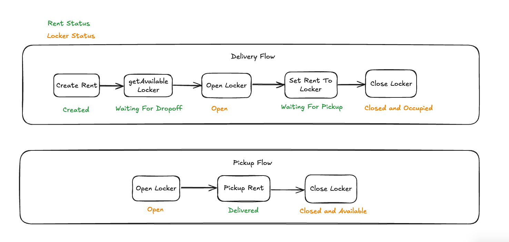

# Locker Management

This API aims to facilitate the process of assisting first, middle, and last-mile deliveries. The main flows are designed for drop-off and pick-up of rentals.

## 🚀 How to Install

1. Clone the repository:

2. Install dependencies:
   ```bash
   npm install
   ```

## 💻 How to Run

1. Build the project:
   ```bash
   npm run build
   ```

2. Start the development server:
   ```bash
   npm run dev
   ```

3. Run tests:
   ```bash
   npm run tests
   ```

## 📋 Flows Developed



*Add your flow diagram image here*

## 🔧 Technologies Used

- Node.js
- TypeScript
- Jest (Testing)

## 📝 API Features

- Drop-off rental management
- Pick-up rental management
- Locker status tracking
- Secret/password generation for locker access
